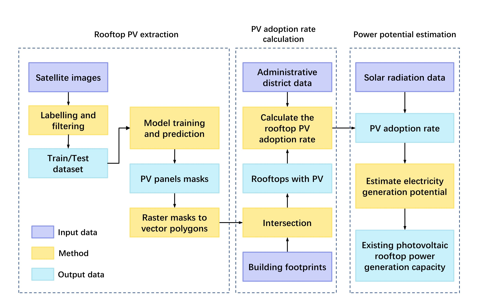
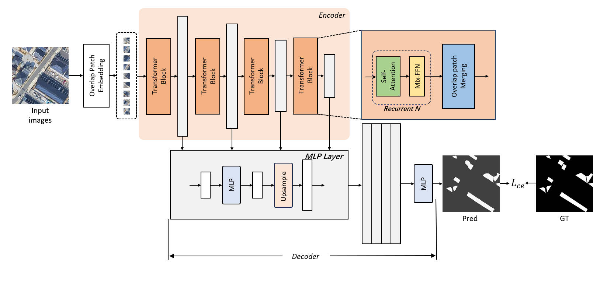
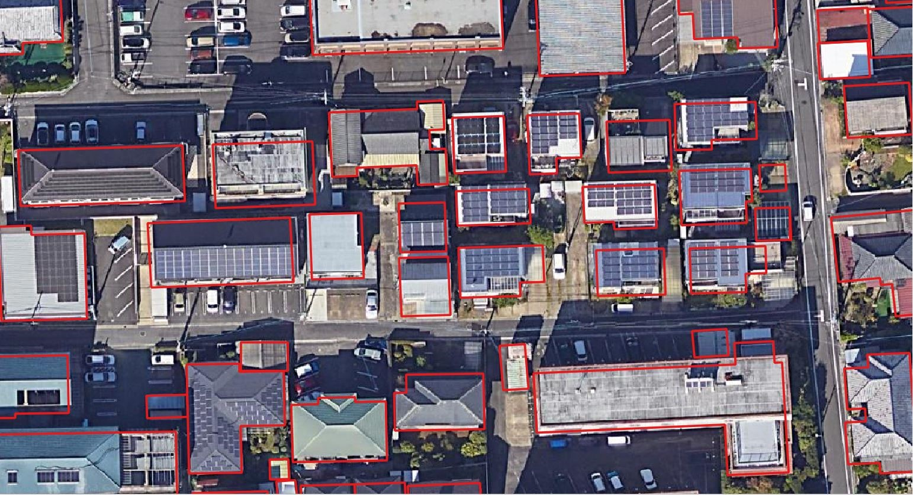
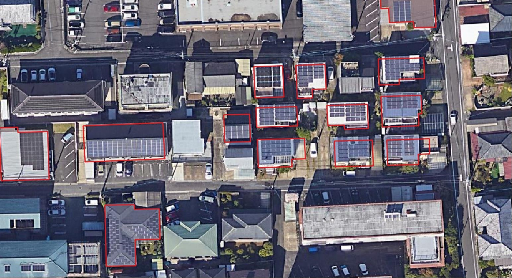

# Inferring-the-rooftop-PV-adoption-rate

## Overview

Increasing renewable energy generation is a pivotal approach for attenuating the global warming crisis and attaining sustainable development. With the development of GIS, remote sensing, and computer vision, it is crucial to develop a comprehensive framework to automatically estimate rooftop photovoltaic utilization.

## Workflow

The workflow can be devided into 3 steps: rooftop pv extraction, PV adoption rate calculation and power generation estimation. This repository mainly shows the two methods:

1. Model training and prediction
  
2. Raster masks to vector polygons and intersection
  

For method 1, we utilize a transformer-based segmentation model known as SegFormer. This model has demonstrated remarkable efficacy across various computer vision applications. It comprises an encoder with multi-stage transformer blocks and an all-MLP decoder that integrates multi-level features from the encoder and generates binary predictions indicating the presence or absence of PV.

For method 2, we firstly convert predition results (raster format) to polygon features (vector format) and then use GIS spatial analysis operation--Intersect, to identify the rooftops with pv panels.

## Usage

**Predict.py** -- Use the checkpoints trained from SegFormer to extract pv panels from satellite images

input_dir = path to satellite images
output_dir = path to prediction results

**Intersect.py** -- Convert pv masks to pv polygons, get the pv roofs by intersecting the pv polygons and the building footprints.

input_mask = input path to model prediction results (raster masks)  
output_pv_feature = output path to pv polygons (vector features)  
Bld_footprints = input path to building footprints (vector features)  
Bld_with_pv = output path to building footprints with pv panels (vector features)

## Checkpoints availability

https://figshare.com/articles/dataset/Checkpoints_for_SegFormer/25334401

## Feedback

Feel free to send any questions/feedback to: szhanger@connect.ust.hk
